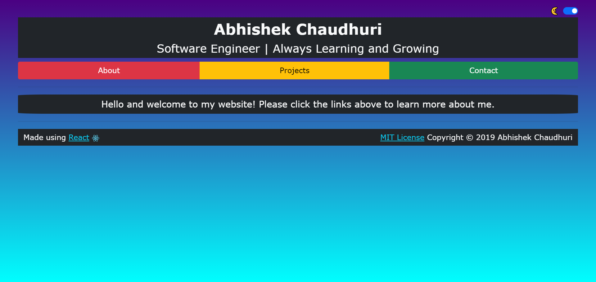

# My Website

[](https://github.com/Abhiek187/abhiek187.github.io/actions/workflows/node.js.yml)



## About

This is my portfolio website created in React, inspired by Udacity's Front-End Web Development course. It showcases the projects I'm most passionate about with the creative freedom of developing a website. This repo will always be updated as I learn more about the best web practices and come up with ideas to further improve the website. You can check out [my website](https://abhiek187.github.io) to learn more and get in touch with me.

## Features

- React as the web framework
- TypeScript for added type safety
- SCSS for enhanced CSS syntax
- Bootstrap to improve the UI
- Light and dark mode
- 40+ tests for the 5 main views using the React Testing Library
- Accessible and responsive web design
- Best practices for Progressive Web Apps
- Efficient delivery of static content by utilizing WebP images and WebM videos
- Search Engine Optimization (SEO)
- CI/CD workflows after every commit or PR to main
- Continuous updates and improvements

## Dependencies

This project was bootstrapped with [Create React App](https://github.com/facebook/create-react-app).<br>
[React Router](https://reacttraining.com/react-router) was used to create the single-page experience.<br>
[gh-pages](https://github.com/tschaub/gh-pages) was used to deploy the website to the gh-pages branch.

To create a local copy, you'll need the following command-line programs:

- git: `apt-get install git`
- npm (part of Node.js):

```
sudo apt update
sudo apt install nodejs npm
```

- serve: `npm i serve`

## Running the Program

Click on [this link](https://abhiek187.github.io) to view my website on GitHub Pages.

-OR-

Start by setting up the local environment:

```
git clone https://github.com/Abhiek187/abhiek187.github.io.git
cd abhiek187.github.io
npm install
```

Make sure to keep in the mind the [branches](#branches) when doing development work. If just running the program, stick to the **main** branch.

## Available Scripts

In the project directory, you can run:

### `npm start`

Runs the app in the development mode.<br>
Open [http://localhost:3000](http://localhost:3000) to view it in the browser.

The page will reload if you make edits.<br>
You will also see any lint errors in the console.

Note: Service workers (aka offline functionality) will not work in development mode.

### `npm test`

Launches the test runner in the interactive watch mode.<br>
See the section about [running tests](https://facebook.github.io/create-react-app/docs/running-tests) for more information.

### `npm run build`

Builds the app for production to the `build` folder.<br>
It correctly bundles React in production mode and optimizes the build for the best performance.

The build is minified and the filenames include the hashes.<br>
Your app is ready to be deployed!

See the section about [deployment](https://facebook.github.io/create-react-app/docs/deployment) for more information.

To run the production build, run `serve -s build` and open [http://localhost:5000](http://localhost:5000) to view it in the browser.

### `npm run eject`

**Note: this is a one-way operation. Once you `eject`, you can’t go back!**

If you aren’t satisfied with the build tool and configuration choices, you can `eject` at any time. This command will remove the single build dependency from your project.

Instead, it will copy all the configuration files and the transitive dependencies (Webpack, Babel, ESLint, etc) right into your project so you have full control over them. All of the commands except `eject` will still work, but they will point to the copied scripts so you can tweak them. At this point, you’re on your own.

You don’t have to ever use `eject`. The curated feature set is suitable for small and middle deployments, and you shouldn’t feel obligated to use this feature. However, we understand that this tool wouldn’t be useful if you couldn’t customize it when you are ready for it.

## Learn More

You can learn more in the [Create React App documentation](https://facebook.github.io/create-react-app/docs/getting-started).

To learn React, check out the [React documentation](https://reactjs.org/).

## Branches

Due to the way GitHub Pages is set up for user pages, this project has been split into 3 branches:

### main

This is the default branch for this repo, where all production code is held. See [Contributing](https://github.com/Abhiek187/abhiek187.github.io/blob/main/CONTRIBUTING.md) for info on how to create the other branches.

### gh-pages

This is the default branch gh-pages uses for deployment. It has all the minified content needed to properly deploy this on [abhiek187.github.io](https://abhiek187.github.io).

### master

GitHub used to require that all user pages be deployed to master. But as of 2020, any branch can host a user page. However, gh-pages will still throw an error if there isn't a master branch. So, this branch is used as a backup for gh-pages.

## Miscellaneous

- [Code of conduct](https://github.com/Abhiek187/abhiek187.github.io/blob/main/CODE_OF_CONDUCT.md)
- [Contributing](https://github.com/Abhiek187/abhiek187.github.io/blob/main/CONTRIBUTING.md)
- [License](https://github.com/Abhiek187/abhiek187.github.io/blob/main/LICENSE)
- [Issue templates](https://github.com/Abhiek187/abhiek187.github.io/tree/main/.github/ISSUE_TEMPLATE)
- [Pull request template](https://github.com/Abhiek187/abhiek187.github.io/blob/main/PULL_REQUEST_TEMPLATE.md)
